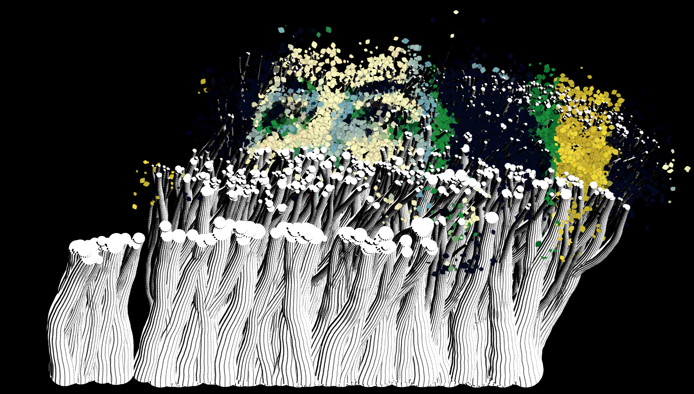
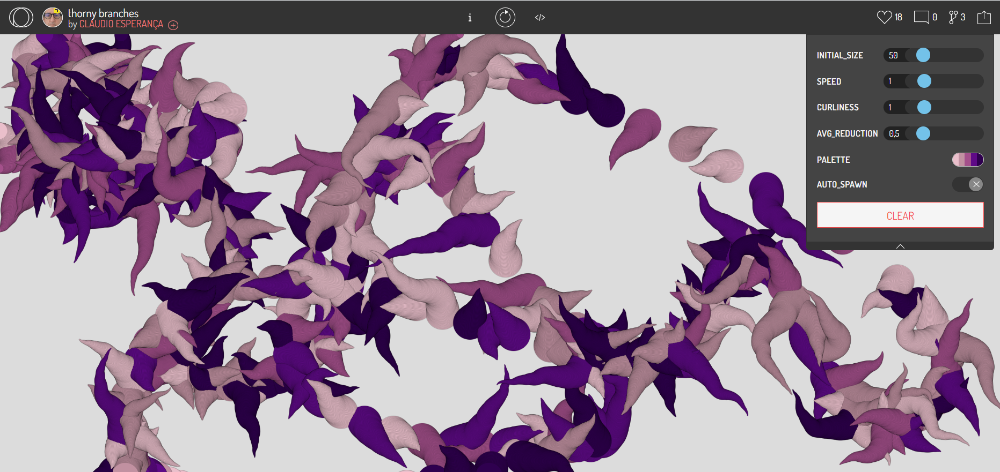
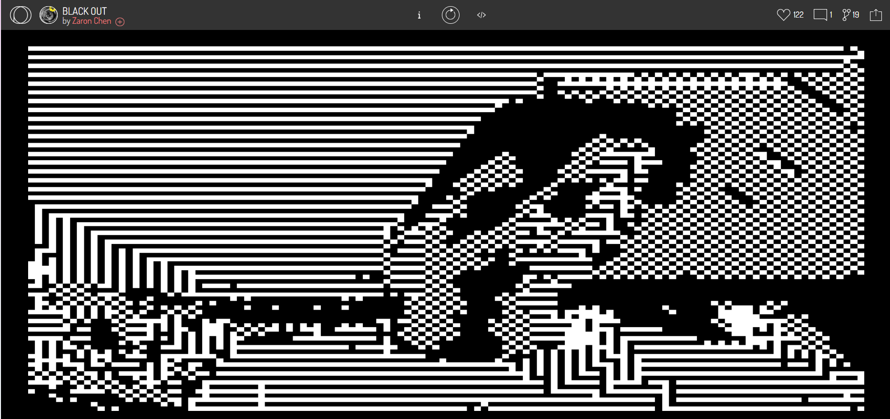

### EJEMPLO 1
**Nombre del proyecto/artista:** Marielle Semente by Vamoss

**URL o enlace al proyecto :** https://openprocessing.org/sketch/873380/embed/

**Breve descripción del proyecto**: Este proyecto se trata de dibujar con el cursor líneas compuestas por particulas que van cayendo y al llegar al piso (parte 
inferior de la pantalla) salen unas líneas más gruesas ascienden hasta más o menos la mitad de la pantalla y arman conjuntamente una imagen. 

**Una imagen o captura de pantalla del proyecto**:

### EJEMPLO 2
**Nombre del proyecto/artista**: Thorny branches by Claudio Esperanca

**URL o enlace al proyecto**: https://openprocessing.org/sketch/2398334

**Breve descripción del proyecto**: Cuando haces clic y desplazas el cursor se dibujan en la pantalla unos tipos de raices en tonos morados y se sobreponen si pasas el cursor por donde ya hay raices. 

**Una imagen o captura de pantalla del proyecto**:

### EJEMPLO 3

**Nombre del proyecto/artista**: BLACK OUT by Zaron Chen

**URL o enlace al proyecto** : https://openprocessing.org/sketch/2136720

**Breve descripción del proyecto**: Por medio de la cámara del computador se retracta la imagen y se muestra por medio de cuadritos blancos y se actualiza la imagen constantemente. 

**Una imagen o captura de pantalla del proyecto**:

