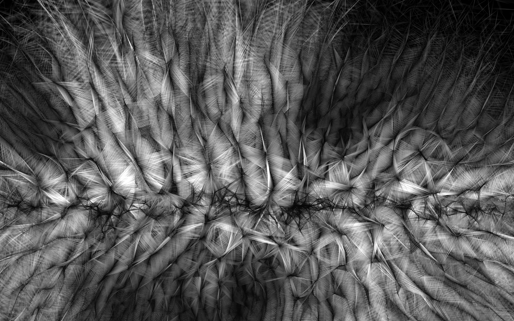
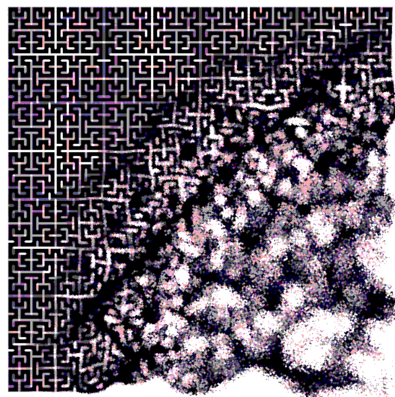

### Casey Reas
Casey Reas (nacido en 1972 en Estados Unidos) es un artista y educador reconocido por su trabajo en arte generativo y medios digitales. Estudió diseño y medios en el MIT Media Lab bajo la dirección de John Maeda. En 2001, junto con Ben Fry, creó Processing, un lenguaje de programación de código abierto diseñado para artistas y diseñadores. Su obra se centra en la relación entre el código y la imagen, explorando cómo las estructuras algorítmicas pueden generar visualizaciones complejas y orgánicas.
#### Obra 1 - Real Time
En esta obra, Reas utiliza Processing para crear visualizaciones dinámicas basadas en patrones generativos en tiempo real. Las formas geométricas evolucionan constantemente, mostrando sistemas complejos que simulan movimientos orgánicos.

#### Obra 2 -Process Compendium
Una serie de trabajos en los que Reas traduce procesos de software en arte visual impreso. Cada pieza es el resultado de una combinación de instrucciones algorítmicas, donde líneas y figuras simples forman composiciones abstractas a gran escala.
#### Influencias
El trabajo de Casey Reas está influenciado por el arte generativo y los sistemas algorítmicos, siguiendo la línea de artistas conceptuales como Sol LeWitt, que crean obras a partir de instrucciones. Su obra refleja también elementos del Op Art y el arte cinético, con patrones dinámicos y juegos de percepción visual inspirados en Victor Vasarely y Bridget Riley.

imagen de una de las obras:  "Process Compendium "

### Zaron Chen
Zaron Chen es un programador Creativo, artista generativo y desarrollador Front-end ubicado en Taiwán. Desde 2022 a estado explorando la programación creativa desde 2022 y sus principales herramientas para crear arte son p5.js, GLSL, TouchDesigner. En su autobiografia aclara que tieneexperiencia en desarrollo tanto front-end como back-end, como la creación de este sitio web personal utilizando React y Next.js. 
#### Obra 1 - Reaction-Diffusion
Para esta obra el artista usó una ecuación matemática de reacción difusión (Es una ecuación que describe la dinámica acoplada de concentraciones químicas o poblaciones en interacción) que es la que le da la forma al sistema. También tiene la
implementación del mouse (para generar la interación con la forma del sistema)y de la barra de espacio (modifica uno de los parámetros).

#### Obra 2 - Hilbert
El artista utiliza algoritmos matemáticos avanzados, como sistemas fractales, para construir las complejas formas repetitivas y autosimilares que definen "Hibert". Estos algoritmos permiten que la obra evolucione y se transforme en tiempo real.

#### influencias

La obra de Zaron Chen refleja influencias del arte generativo y el uso de algoritmos, siguiendo la línea de artistas como Casey Reas y Manfred Mohr. También muestra una fuerte conexión con el minimalismo y el arte geométrico, con patrones repetitivos y composiciones simétricas. Además, se inspira en estructuras matemáticas como la curva de Hilbert y procesos fractales, integrando arte y ciencia. Su obra representa una fusión de tecnología, percepción visual y abstracción matemática.
