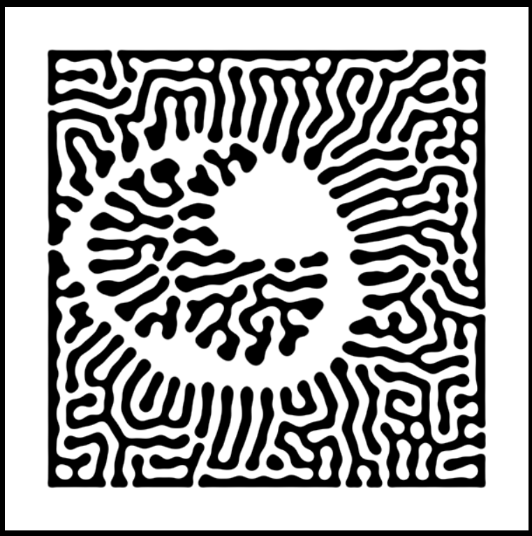

### Rafaël Rozendaal

Rafaël Rozendaal es un artista digital y generativo contemporáneo conocido por sus instalaciones interactivas, arte web y NFT. Nacido en 1980 en los Países Bajos,
Rozendaal crea obras que existen principalmente en línea, utilizando el internet como su lienzo. Sus piezas suelen ser sitios web interactivos, 
donde los usuarios pueden explorar y manipular elementos visuales en tiempo real.
#### Obra 1

#### Obra 2

### Zaron Chen
Zaron Chen es un programador Creativo, artista generativo y desarrollador Front-end ubicado en Taiwán. Desde 2022 a estado explorando la programación creativa desde 2022 y sus principales herramientas para crear arte son p5.js, GLSL, TouchDesigner. En su autobiografia aclara que tieneexperiencia en desarrollo tanto front-end como back-end, como la creación de este sitio web personal utilizando React y Next.js. 
#### Obra 1 - Reaction-Diffusion
Para esta obra el artista usó una ecuación matemática de reacción difusión (Es una ecuación que describe la dinámica acoplada de concentraciones químicas o poblaciones en interacción) que es la que le da la forma al sistema. También tiene la
implementación del mouse (para generar la interación con la forma del sistema)y de la barra de espacio (modifica uno de los parámetros).

#### Obra 2 - Hilbert
El artista basó el arte de este sistema en algo llamado la curva de Hilbert,  
