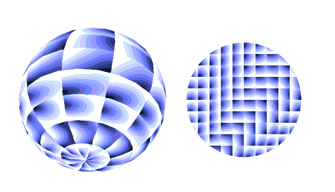
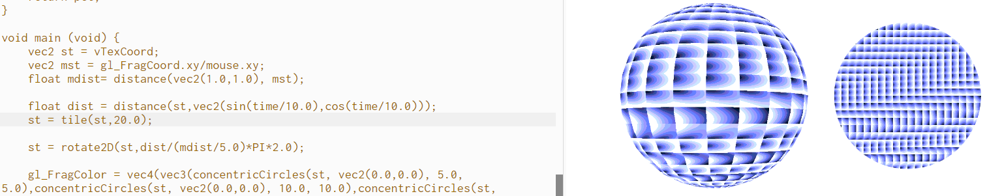
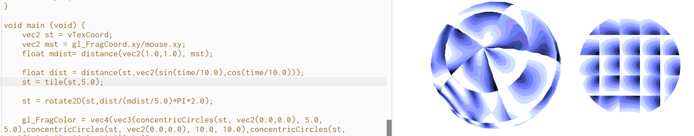
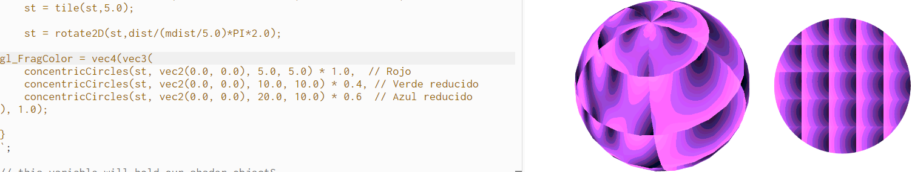

### EJEMPLO 1 - Pie anaconda 

**Descripción del código:** 
El código genera una visualización interactiva en 3D utilizando p5.js y shaders personalizados. La funcionalidad principal es renderizar una esfera y una elipse con patrones generativos que cambian en tiempo real en respuesta al movimiento del ratón y el paso del tiempo.
**Modificación del código:** 

1. Una parte del código se encarga de generar las cuadriculas del circulo y la esfera, quise modificar los tiles así que jugué con ese parámetro, primero decidí aumentar la cantidad de cuadritos y luego la disminuí.
   

2. Aquí lo que hice fue modificar los tonos de colores de las ondas que se generan en la esfera y circulo. En las imagenes anteriores se puede ver como el parametro gl_FragColor es el que maneja los colores de los dos objetos, lo que hice fue que para que se viera rosita ajusté con ayuda de la IA el cálculo del color para que utilice más componentes de rojo y menos de azul y verde.

**Reflexión:** 
De esta experimentación aprendí mucho sobre la interacción de los shaders con p5.js, esto ayuda a crear efectos visuales complejos y más dinámicos directamente desde p5.js. Además, terminé de confirmar que las matematicas son demasiado importantes dentro del arte generativo, ya que tanto con esta experimentación como con las de las actividades anteriores los artistas han basado sus obras de arte generativo en formulas matemticas logrando efectos visuales muy top. 
