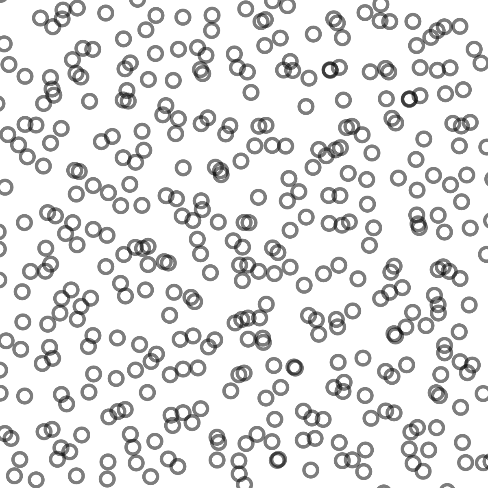
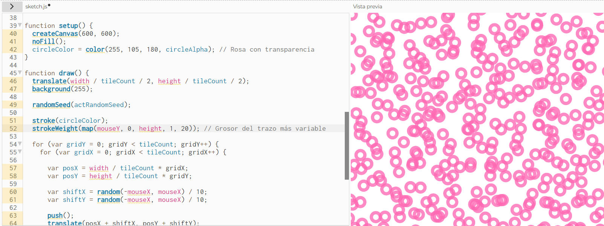
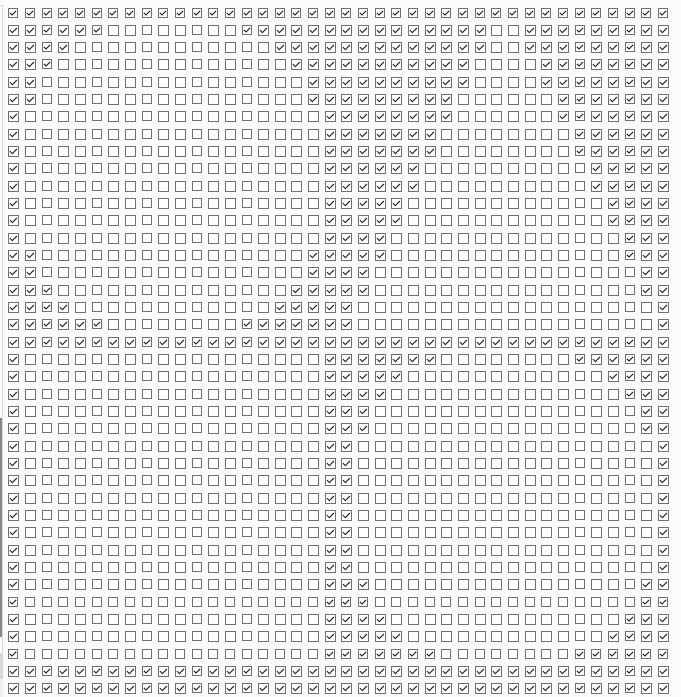
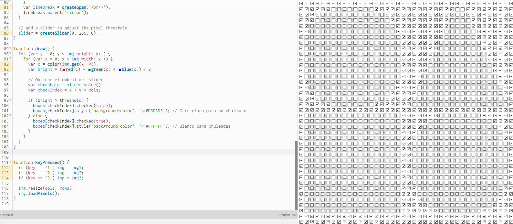
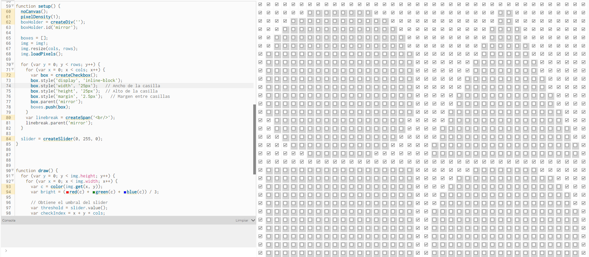
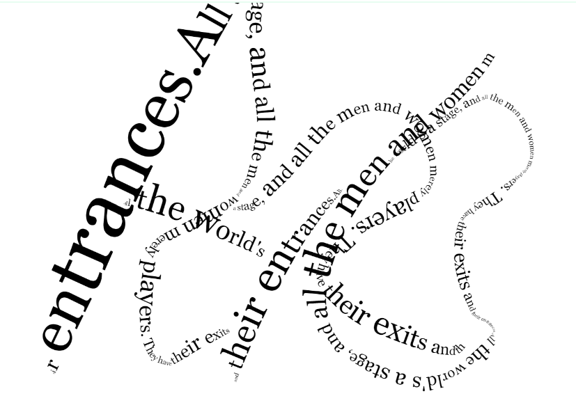
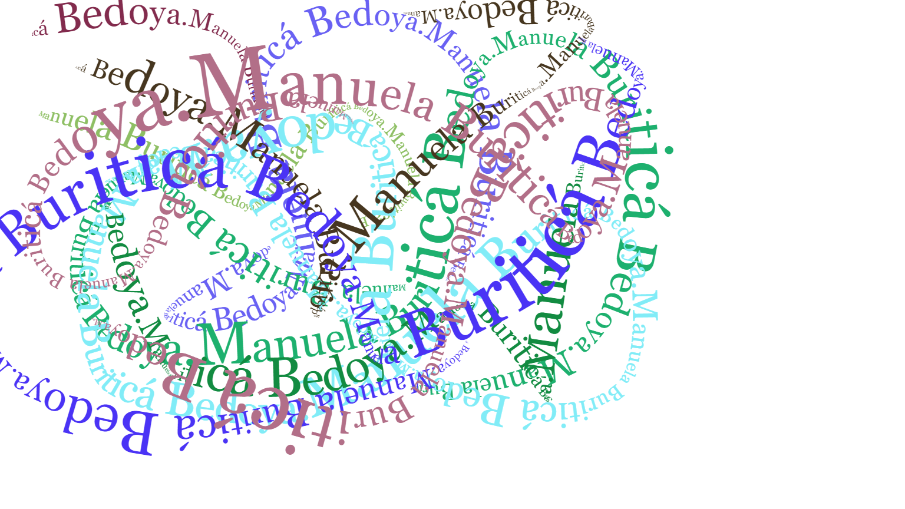

#### EJEMPLO 1 - P_2_1_2_01 de generative-design



**Descripción**

Este código crea una cuadrícula de círculos, cuya posición, tamaño y apariencia cambian en función de la posición del mouse y la interacción del usuario. Los parámetros utilizados son:
- **tileCount (20):** Define el número de filas y columnas de la cuadrícula.
- **circleAlpha (130):** Define la transparencia del color del trazo de los círculos.
- **circleColor (negro con alpha 130):** Color del trazo de los círculos.
- **mouseX:** Controla el desplazamiento aleatorio de los círculos en las direcciones X e Y (shiftX y shiftY).Cuanto más a la derecha esté el mouse, mayor será el rango de desplazamiento.
- **mouseY:** Controla el tamaño de los círculos (mouseY / 15) y el grosor del trazo (mouseY / 60).Cuanto más abajo esté el mouse, más grandes y gruesos serán los círculos.

**Variaciones**
Las variaciones que hice fueron en el color de los circulos, de negro a rosado y en el grosor de los circulos donde se lo aumenté y ahora son más gorditos. Esto lo hice modificando ambos parametros, **circleColor** para obtener el rosado y **strokeWeight** para modificar el tamaño de los circulos. 
En la imagen se pueden observar ambos parámetros modificados:



#### EJEMPLO 2 - P_2_1_4_01 de generative-design



**Descripción**

Este código en p5.js crea una representación gráfica de una imagen usando una cuadrícula de casillas de verificación (checkboxes) en lugar de píxeles. Dependiendo del brillo de cada píxel en la imagen y del valor del deslizador, las casillas de verificación se activan o desactivan para generar una representación visual del contenido de la imagen. Los parámetros importantes son: 

- **Imágenes:** Se cargan tres imágenes (shapes.png, draw.png y toner.png), que el usuario puede alternar usando las teclas 1, 2 y 3.

- **Grilla de casillas:** La grilla tiene un tamaño fijo de 40x40. Cada casilla representa un píxel de la imagen redimensionada. box.style('display', 'inline') asegura que las casillas se alineen horizontalmente para formar una cuadrícula.

- **Umbral de brillo (threshold):** Ajustado por el deslizador (slider), con valores entre 0 y 255. Determina si una casilla debe estar marcada (checked) o no, en función del brillo del píxel.

- **Brillo de los píxeles:** Calculado como el promedio de los valores de rojo, verde y azul ((red + green + blue) / 3). Comparado con el valor del deslizador para decidir si el checkbox se activa.

**Variaciones**

1. La variación que decidí hacer para este proyecto iba en modificar el color de las casillas que no estaban chuleadas para que se vieran más claras las figuras que  intentaba mostrar así que para esto y con ayuda de la IA modificamos el código para que cambie el color de fondo de cada casilla según su estado, entonces si  la casilla está chuleada su color será blanco y si la casilla está  sin chulear será gris clarito. Además añadimos el método style() el cual aplicamos estilos CSS dinámicamente y es el que basicamente logra que se identifique el estado  de la casilla:
- **Casillas chuleadas (checked(true)):** Se colorean de blanco (#FFFFFF).
- **Casillas no chuleadas (checked(false)):** Se colorean de gris claro (#D3D3D3).
- **El método style()** aplica los estilos CSS dinámicamente en cada actualización del draw().



2. La segunda variación que intenté hacer fue el tamaño de la casilla para que se viera más grande la figura. Entonces lo que hice fue añadir los parámetros de ancho, largo y margen de las casillas a la función setup() para poder modificar su tamaña según los pixeles.



#### EJEMPLO 3 - P_2_3_3_01 de generative-design


**Descripción**

Este código es un generador gráfico interactivo basado en texto que permite dibujar letras en la pantalla siguiendo la trayectoria del mouse, utilizando p5.js. Cada letra del texto "Manuela Buriticá Bedoya." (modifiqué el texto original y me pareció una nota) se dibuja consecutivamente a medida que el usuario arrastra el mouse, y las letras se rotan dinámicamente según la dirección del movimiento del cursor. Los parámetros que se utilizan son:

- **letters:** contiene el texto que se dibuja letra por letra. Aquí es "Manuela Buriticá Bedoya.".
- **fontSizeMin:** define el tamaño mínimo de la letra. A medida que el usuario mueve el mouse, el tamaño del texto aumenta en proporción a la distancia recorrida.
- **angleDistortion:** controla la distorsión angular de las letras.
- **Valores positivos** hacen que las letras roten de forma más aleatoria.
- **Valores negativos** reducen el efecto de rotación aleatoria.
- **stepSize:** define la distancia mínima que el cursor debe recorrer para dibujar la siguiente letra. Depende del ancho (textWidth) de la letra actual.

**Variaciones**

1. Para hacerlo más colorido quise añadir al código que cada que el usuario haga un clic y mueva el mouse se cambie el color aleatoriamente. Para lograr esto añadí una variable letterColor para almacenar el color actual de las letras, la función changeColor() genera un nuevo color aleatorio usando random(255) para los valores de rojo, verde y azul y cada vez que se hace clic (mousePressed()), la función changeColor() actualiza el color de las letras. En esta ocación voy a agregar el código y la imagen por aparte para que se logre visualizar todos los cambios que hice, es importante aclarar que algunas cosas las hice con ayuda de la IA como la creación de la función que me ayudara a la generación del color aleatorio:
   


**Código completo modificado**

```
'use strict';

var x = 0;
var y = 0;
var stepSize = 5.0;

var font = 'Georgia';
var letters = 'Manuela Buriticá Bedoya.';
var fontSizeMin = 3;
var angleDistortion = 0.0;

var counter = 0;
var letterColor; // Variable para almacenar el color de las letras

function setup() {
  createCanvas(displayWidth, displayHeight);
  background(255);
  cursor(CROSS);

  x = mouseX;
  y = mouseY;

  textFont(font);
  textAlign(LEFT);
  changeColor(); // Inicializa el primer color aleatorio
}

function draw() {
  if (mouseIsPressed && mouseButton == LEFT) {
    var d = dist(x, y, mouseX, mouseY);
    textSize(fontSizeMin + d / 2);
    var newLetter = letters.charAt(counter);
    stepSize = textWidth(newLetter);

    if (d > stepSize) {
      var angle = atan2(mouseY - y, mouseX - x);

      push();
      translate(x, y);
      rotate(angle + random(angleDistortion));
      fill(letterColor); // Aplica el color aleatorio
      text(newLetter, 0, 0);
      pop();

      counter++;
      if (counter >= letters.length) counter = 0;

      x = x + cos(angle) * stepSize;
      y = y + sin(angle) * stepSize;
    }
  }
}

function mousePressed() {
  x = mouseX;
  y = mouseY;
  changeColor(); // Cambia el color cada vez que se hace clic
}

function keyReleased() {
  if (key == 's' || key == 'S') saveCanvas(gd.timestamp(), 'png');
  if (keyCode == DELETE || keyCode == BACKSPACE) background(255);
}

function keyPressed() {
  if (keyCode == UP_ARROW) angleDistortion += 0.1;
  if (keyCode == DOWN_ARROW) angleDistortion -= 0.1;
}

// Función para generar un color aleatorio
function changeColor() {
  letterColor = color(random(255), random(255), random(255));
}
```
2. El segundo cambio que hice fue muy similar al primero: quise que cada


