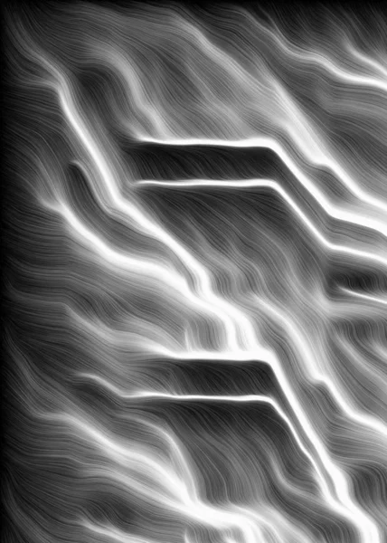
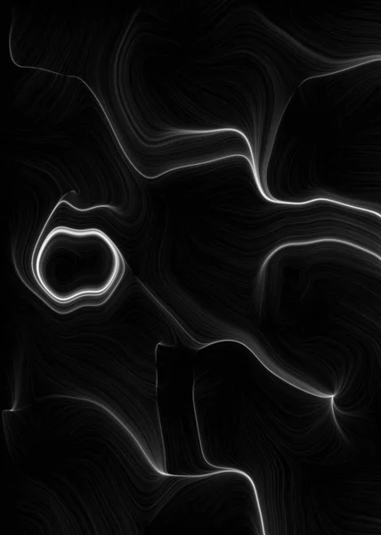
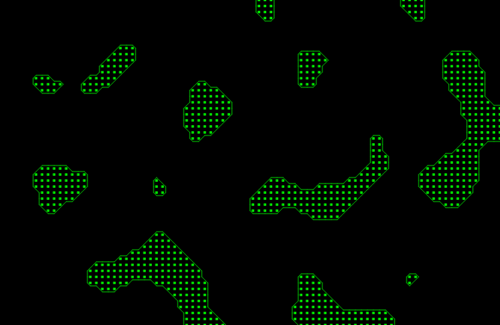
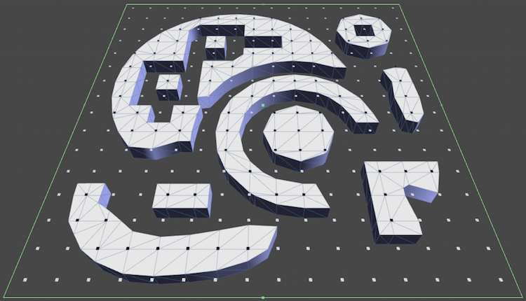
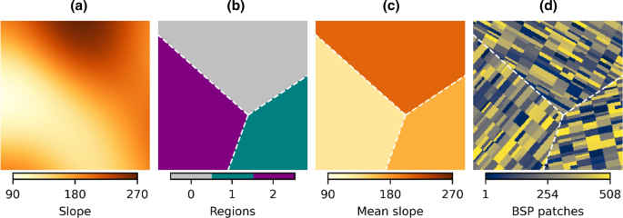

### Técnica 1: Random Noise

**Descripción:** Técnica básica que consiste en generar valores aleatorios para crear patrones o texturas.

**Principio básico:** El ruido aleatorio genera valores de forma independiente y sin relación entre ellos, lo que da como resultado un patrón caótico. Estos valores se pueden representar como números entre 0 y 1, o como colores si se usan para gráficos.

**Funcionamiento:**

1. Se define una cuadrícula o una serie de puntos.
2. A cada punto se le asigna un valor aleatorio.
3. Los valores se pueden usar para crear texturas, alturas o posiciones de objetos.

**Ejemplo de uso:**

**Potencial**

- **Experiencias inmersivas y únicas:** Los mapas generados con ruido aleatorio nunca serán iguales, fomentando la rejugabilidad.

- **Interacción con entornos dinámicos:** Se puede usar para generar efectos visuales y sonoros en tiempo real, como cambios de clima o variaciones de terreno.

- **Personalización:** Permite que los usuarios influyan en la generación del contenido ajustando parámetros, como la densidad o escala del ruido.

### Técnica 2:Marching Squares

**Descripción:** Algoritmo para generar contornos suaves a partir de una matriz de datos en 2D. Evalúa las esquinas de un cuadrado y decide cómo trazar líneas para representar superficies continuas.

**Principio básico:** Este algoritmo busca identificar contornos continuos en una matriz 2D de valores (por ejemplo, alturas o densidades). Evalúa las esquinas de un cuadrado en la matriz y decide cómo dibujar una línea entre ellas para crear una superficie suave.

**Funcionamiento**

1. Se recorre la matriz dividiéndola en pequeños cuadrados.
2. Cada esquina del cuadrado se evalúa como "dentro" o "fuera" de un umbral. Esto genera 16 combinaciones posibles.
3. Según la combinación, se dibuja una línea para conectar las esquinas y representar el contorno.
4. El proceso se repite para toda la matriz, uniendo las líneas para formar una superficie continua.

**Ejemplo de uso:**

**Potencial:**

Esta técnica es ideal para generar entornos interactivos suaves y orgánicos que reaccionen a las acciones del jugador.

- **Entornos destructibles o modificables:** Los jugadores pueden cavar, construir o deformar el terreno en tiempo real.
  
- **Visualización de datos en juegos educativos o simulaciones:** Mostrar campos de fuerza o calor que evolucionan según las acciones del usuario.
  
- **Estética fluida y continua:** Se adapta bien a juegos con arte minimalista o formas suaves, como en simulaciones de fluidos o biología digital.

### Técnica 3:Binary Space Partitioning - BSP

**Descripción:** Algoritmo para generar contornos suaves a partir de una matriz de datos en 2D. Evalúa las esquinas de un cuadrado y decide cómo trazar líneas para representar superficies continuas.

**Principio básico:** La técnica divide un espacio en partes más pequeñas de forma recursiva, usando líneas (2D) o planos (3D). Cada división crea dos subespacios. El proceso continúa hasta que se alcanzan las dimensiones deseadas.

**Funcionamiento**

1. Se selecciona una línea o plano para dividir el espacio en dos partes.
2. Cada subespacio se divide de nuevo de forma recursiva.
3. El proceso se detiene cuando las subdivisiones alcanzan un tamaño mínimo.
4. El resultado es un conjunto de regiones organizadas jerárquicamente.
   
**Ejemplo de uso:**

**Potencial:**

Esta técnica proporciona estructuras bien definidas y organizadas, ideales para la creación de espacios coherentes y complejos.

- **Generación de niveles laberínticos:** Perfecta para mazmorras, edificios o laberintos con rutas lógicas.

- **Optimización de la experiencia visual:** Mejora el rendimiento en juegos 3D al simplificar la detección de colisiones y el cálculo de visibilidad.
  
- **Narrativas emergentes:** Las estructuras generadas pueden contener eventos o desafíos únicos en cada partida, enriqueciendo la historia de forma procedural.
