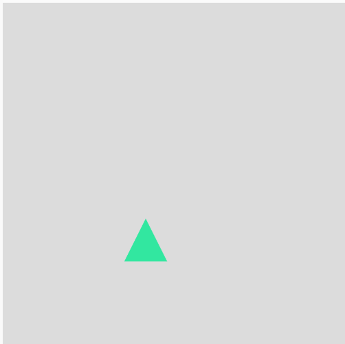
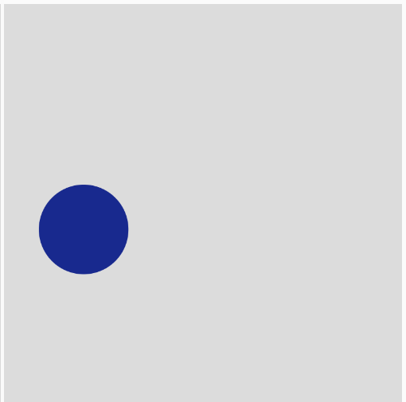
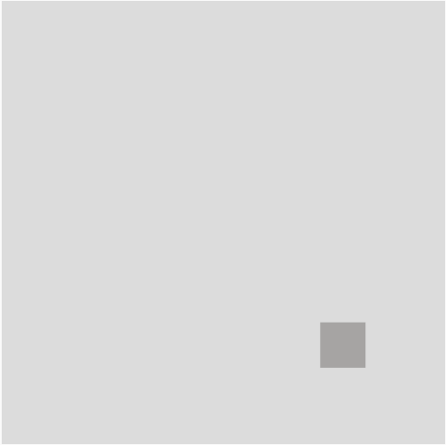

**DOCUMENTACIÓN CÓDIGO:**

Para esta actividad empecé a trabajar yo solita sin ayuda de la IA y orientandome de los ejercicios de las actividades anteriores, solo logré que se dibujaran las tres figuras y no fui capaz de hacer que las figuras cambiaran aleatoriamente así que le dije a la IA que me dijera que estaba haciendo mal, me corrigió y entendí muy bien como hacer este ejercicio: 

**Código**
```
let currentFigure;

function setup() {
  createCanvas(400, 400);
  background(220);
}

function draw() {
  background(220); // Limpiar el lienzo en cada cuadro
  if (currentFigure) {
    drawFigure(currentFigure);
  }
}

// Función para crear una figura aleatoria
function changeFigure() {
  const figureTypes = ["circle", "square", "triangle"];
  let figureType = random(figureTypes); // Selecciona un tipo de figura aleatorio
  
  let x = random(width);
  let y = random(height);
  let size = random(30, 100); // Tamaño aleatorio entre 30 y 100
  let color = [random(255), random(255), random(255)]; // Color aleatorio

  currentFigure = { type: figureType, x, y, size, color }; // Guarda la figura con sus propiedades
}

// Función para dibujar una figura según su tipo y propiedades
function drawFigure(figure) {
  fill(figure.color);
  noStroke();

  switch (figure.type) {
    case "circle":
      ellipse(figure.x, figure.y, figure.size, figure.size);
      break;
    case "square":
      rect(figure.x, figure.y, figure.size, figure.size);
      break;
    case "triangle":
      let halfSize = figure.size / 2;
      triangle(
        figure.x, figure.y - halfSize,
        figure.x - halfSize, figure.y + halfSize,
        figure.x + halfSize, figure.y + halfSize
      );
      break;
  }
}

// Cuando se presiona el mouse, se genera una nueva figura
function mousePressed() {
  changeFigure();
}
```
A este código quise añadir la funcionabilidad de que cada que se presionara el mouse cambiara de forma aleatoriamente, tambien su color y tamaño. 






