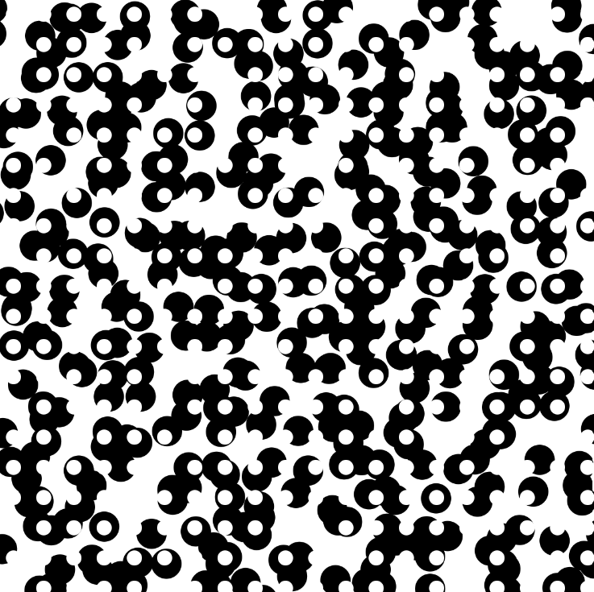
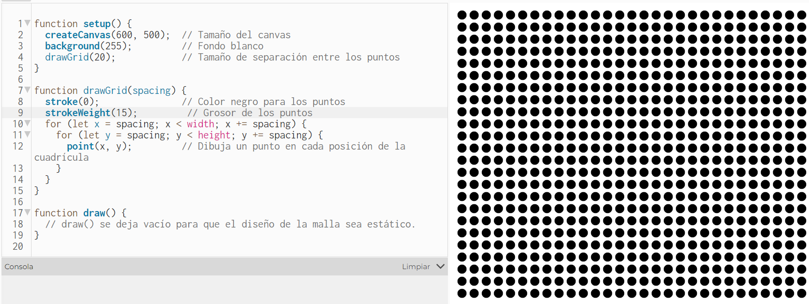
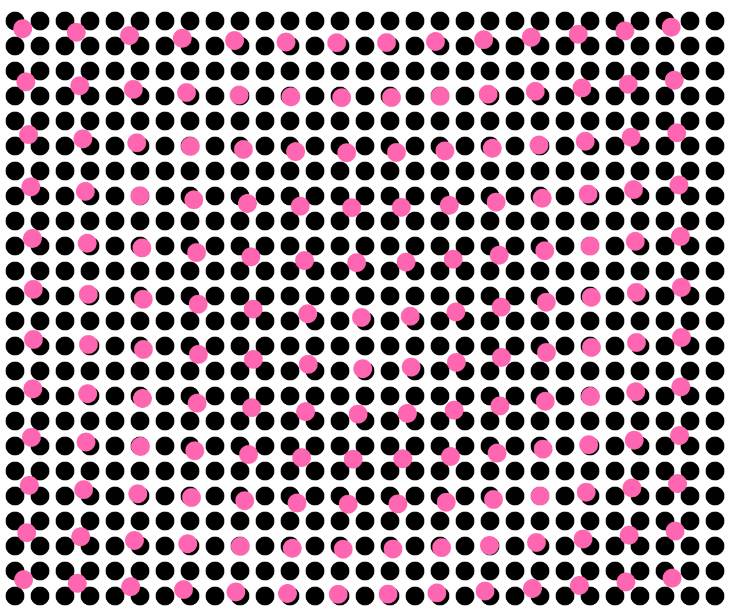

### DECONSTRUCCIÓN
[Enlace al proyecto a deconstrucción](http://www.generative-gestaltung.de/2/sketches/?01_P/P_2_1_2_02)



### RECONSTRUCCIÓN

**Descripción del proceso:** 

1. Lo primero que decidí intentar hacer fue la malla de puntos blancos estáticos que tiene la versión original del proyecto. Para poder ver la malla decidí hacer las bolitas de color negro mientras tanto. Para hacer las malla tenía medio claro como hacerlo, sabía que el canvas se comporta parecido a una matriz así que sabía que debía crear un ciclo que recorriera el canvas y cada cierto spacio colocar una bolita.Como desconozco el lenguaje de Java y casi no lo he practicado,le expliqué a la IA lo que quería hacer con el canvas y ella me entendió muy bien.



2. Luego añadí la malla interactiva, para esta seguí el código que me dió la IA anteriormente pero no sabía como dejar una malla estática y que la otra fuera interactiva (Luego entendí cómo hacerlo con ayuda de la IA) y por último le dije a la IA que quería que las bolitas interactuaran con el mouse cuando este pasara por encima de ellas y modificaran su posición, no sabía cómo lograr el efecto de movimiento original entonces me quedé con el que la IA me dió. 

3. La reconstrucción se basa en el proyecto original pero no logré una completa igualdad y de cierta manera fue a propósito ya que experimentando llegué a mi propio sketch que genera un efecto visual que me gusta más que el original y quería dejar la malla dinámica de color rosita. 
[Enlace al proyecto a reconstrucción](https://editor.p5js.org/manuuuu15281/sketches/_BKpfSKpi)



### CÓDIGOS

**Código Original**

```
'use strict';

var tileCount = 20;
var actRandomSeed = 0;

var moduleColorBackground;
var moduleColorForeground;

var moduleAlphaBackground = 100;
var moduleAlphaForeground = 100;

var moduleRadiusBackground = 30;
var moduleRadiusForeground = 15;

var backgroundColor;

function setup() {
  createCanvas(600, 600);
  colorMode(HSB, 360, 100, 100, 100);
  noStroke();

  moduleColorBackground = color(0, 0, 0, moduleAlphaBackground);
  moduleColorForeground = color(0, 0, 100, moduleAlphaForeground);

  backgroundColor = color(0, 0, 100);
}

function draw() {
  translate(width / tileCount / 2, height / tileCount / 2);

  background(backgroundColor);

  randomSeed(actRandomSeed);

  for (var gridY = 0; gridY < tileCount; gridY++) {
    for (var gridX = 0; gridX < tileCount; gridX++) {
      var posX = width / tileCount * gridX;
      var posY = height / tileCount * gridY;

      var shiftX = random(-1, 1) * mouseX / 20;
      var shiftY = random(-1, 1) * mouseY / 20;

      fill(moduleColorBackground);
      ellipse(posX + shiftX, posY + shiftY, moduleRadiusBackground, moduleRadiusBackground);
    }
  }

  for (var gridY = 0; gridY < tileCount; gridY++) {
    for (var gridX = 0; gridX < tileCount; gridX++) {

      var posX = width / tileCount * gridX;
      var posY = height / tileCount * gridY;

      fill(moduleColorForeground);
      ellipse(posX, posY, moduleRadiusForeground, moduleRadiusForeground);
    }
  }

}

function mousePressed() {
  actRandomSeed = random(100000);
}

function keyReleased() {

  if (key == 's' || key == 'S') saveCanvas(gd.timestamp(), 'png');

  if (key == '1') {
    if (colorsEqual(moduleColorBackground, color(0, 0, 0, moduleAlphaBackground))) {
      moduleColorBackground = color(273, 73, 51, moduleAlphaBackground);
    } else {
      moduleColorBackground = color(0, 0, 0, moduleAlphaBackground);
    }
  }
  if (key == '2') {
    if (colorsEqual(moduleColorForeground, color(360, 100, 100, moduleAlphaForeground))) {
      moduleColorForeground = color(323, 100, 77, moduleAlphaForeground);
    } else {
      moduleColorForeground = color(360, 100, 100, moduleAlphaForeground);
    }
  }

  if (key == '3') {
    if (moduleAlphaBackground == 100) {
      moduleAlphaBackground = 50;
      moduleAlphaForeground = 50;
    } else {
      moduleAlphaBackground = 100;
      moduleAlphaForeground = 100;
    }

    moduleColorBackground = color(
      hue(moduleColorBackground),
      saturation(moduleColorBackground),
      brightness(moduleColorBackground),
      moduleAlphaBackground
    );
    moduleColorForeground = color(
      hue(moduleColorForeground),
      saturation(moduleColorForeground),
      brightness(moduleColorForeground),
      moduleAlphaForeground
    );
  }

  if (key == '0') {
    moduleRadiusBackground = 30;
    moduleRadiusForeground = 15;
    moduleAlphaBackground = 100;
    moduleAlphaForeground = 100;
    moduleColorBackground = color(0, 0, 0, moduleAlphaBackground);
    moduleColorForeground = color(0, 0, 100, moduleAlphaForeground);
  }

  if (keyCode == UP_ARROW) moduleRadiusBackground += 2;
  if (keyCode == DOWN_ARROW) moduleRadiusBackground = max(moduleRadiusBackground - 2, 10);
  if (keyCode == LEFT_ARROW) moduleRadiusForeground = max(moduleRadiusForeground - 2, 5);
  if (keyCode == RIGHT_ARROW) moduleRadiusForeground += 2;
}

function colorsEqual(col1, col2) {
  return col1.toString() == col2.toString();
}

```

**Código Manuela**

```
let spacingStatic = 20;  // Espaciado de la malla estática
let spacingInteractive = 40;  // Espaciado de la malla interactiva

function setup() {
  createCanvas(600, 500);
  background(255);
  drawStaticGrid(spacingStatic);  // Dibuja la malla estática
}

function draw() {
  background(255);  // Redibuja el fondo para limpiar el movimiento
  drawStaticGrid(spacingStatic);  // Redibuja la malla estática
  drawInteractiveGrid(spacingInteractive);  // Dibuja la malla interactiva
}

// Malla estática (puntos negros pequeños)
function drawStaticGrid(spacing) {
  stroke(0);
  strokeWeight(15);
  for (let x = spacing; x < width; x += spacing) {
    for (let y = spacing; y < height; y += spacing) {
      point(x, y);
    }
  }
}

// Malla interactiva (puntos rosados grandes)
function drawInteractiveGrid(spacing) {
  noStroke();
  fill(255, 102, 178);  // Color rosado
  for (let x = spacing; x < width; x += spacing) {
    for (let y = spacing; y < height; y += spacing) {
      let dx = mouseX - x;
      let dy = mouseY - y;
      let distance = sqrt(dx * dx + dy * dy);
      let offset = map(distance, 0, 200, 20, 0);  // Calcula el desplazamiento según la distancia al mouse
      ellipse(x + offset, y + offset, 15);  // Dibuja las bolitas rosadas desplazadas
    }
  }
}

```
