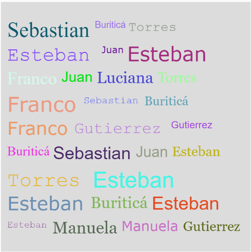

### Documentación programa texto aleatorio
Para este ejecicio me ayudé de la IA para hacer que las palabras empezaran a salir desde la parte superior izquierda (no sabía como hacer eso), además le dije que me construyera el código donde se detectara cuando llegaba al final del canva de forma horizontal e hiciera salto de línea y que las palabras salieron cada cierto tiempo (0.5 seg), finalmente la IA me ayudó a hacer que cuando las palabras rellenaran todo el canvas, lo limpiara y volviera a empezar desde el inicio. 

Finalmente yo cree el arreglo con las palabras que quería que salieran (para poder usar la función random de p5) y el arreglo de los tipos de fuentes que quería que salieran aleatoriamente y en el método draw cree las variables que elegirian aleatoriamente el color, el tamaño (entre 12 y 36) y la fuente de la palabra. 


### Código del programa

[Enlace al proyecto](https://editor.p5js.org/manuuuu15281/sketches/MfZPPpKg7)

```
let phrases = [
  "Juan", "Franco", "Luciana", "Gutierrez", 
  "Manuela", "Buriticá", "Sebastian", "Torres", 
  "Juan", "Esteban"
];
let fonts = ['Georgia', 'Verdana', 'Courier', 'Times New Roman', 'Arial'];
let x = 10; // Posición x inicial
let y = 30; // Posición y inicial
let lineHeight = 40; // Espaciado entre líneas

function setup() {
  createCanvas(600, 500);
  frameRate(2); // Añadir una palabra cada 0.5 segundos
  textAlign(LEFT, TOP);
}

function draw() {
  let nextWord = random(phrases); // Elige una palabra aleatoria
  let randomFont = random(fonts); // Elige una fuente aleatoria
  let randomSize = random(12, 36); // Tamaño de fuente aleatorio
  let randomColor = color(random(255), random(255), random(255)); // Color aleatorio

  textSize(randomSize);
  textFont(randomFont);
  fill(randomColor);

  let wordWidth = textWidth(nextWord + " ");
  
  // Verifica si la palabra cabe en la línea actual
  if (x + wordWidth > width) {
    x = 10;       // Regresa al inicio de la línea
    y += lineHeight; // Baja a la siguiente línea
  }
   
  // Si la posición y excede la altura del canvas, reinicia desde arriba
  if (y + lineHeight > height) {
    background(220); // Limpia el lienzo
    x = 10;
    y = 30;
  }
  
  // Dibuja la palabra
  text(nextWord, x, y);
  x += wordWidth; // Actualiza la posición x para la siguiente palabra
}

```

