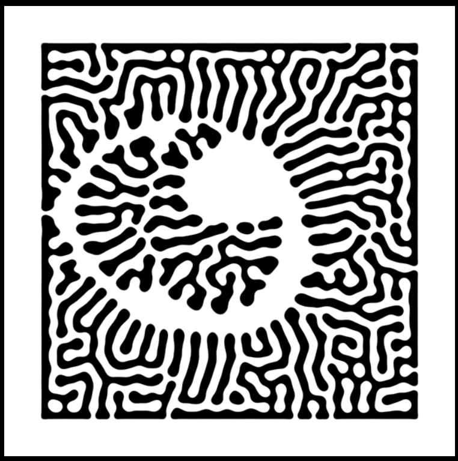
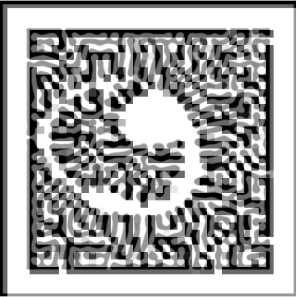

### Documentación del proyecto
1. Para este proyecto primero cargué la imagen con la que quería experimentar en el  skecth files de p5.js y la mostré en el canvas.
2. Como no tenía conocimiento de cómo modificar los píxeles de la imágen ni cómo cambiar su color o modificar su transparencia recurrí a la IA para que me explicara como hacerlo:
    - Primero debo carga los píxeles de la imagen en el array pixels[] (este es el que me permite modificar el color y la transparencia de los píxeles de una imagen en p5.js.
    - Luego con ayuda de dos bucles debo recorrer todos los píxeles de la imagen y según las indicaciones que le demos al programa se generará un efecto visual en la imágen.
      Yo lo que hice con ayuda de la IA fue que cogiera el color promedio de cada píxel y lo pintara con una semitransparencia sobre la imagen para ver cómo se veía:

Este fue el resultado de la experimentación: 

**Imágen original**



**Imágen modificada**



### Código del proyecto 

```
let img;

function preload() {
  img = loadImage('ejemplo4.png'); // Reemplaza con tu archivo
}

function setup() {
  createCanvas(400, 400);
  img.resize(width, height);  // Redimensiona la imagen al tamaño del canvas
  image(img, 0, 0);
  noLoop();  // Para evitar que el dibujo se repita constantemente
}

function draw() {
  img.loadPixels();

  for (let y = 0; y < img.height; y += 10) {
    for (let x = 0; x < img.width; x += 10) {
      let index = (x + y * img.width) * 4;


      // Toma el color promedio de la región de 10x10 píxeles
      let r = img.pixels[index];
      let g = img.pixels[index + 1];
      let b = img.pixels[index + 2];

      // Dibuja un cuadrado semitransparente usando el color promedio
      fill(r, g, b, 150);
      noStroke();
      rect(x, y, 10, 10);
    }
  }
}
```
