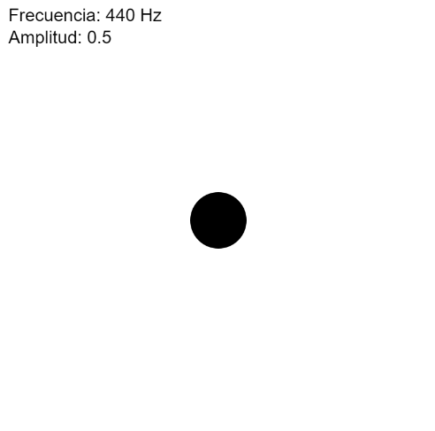

### Documentación del proyecto 
Para este programa no sabía mucho como funcionaba la biblioteca de p5.sound así que necesité ayuda de la IA. Como no sabía casi nada le pedí algo básico para poder analizarlo y entenderlo. Le pedí que me explicara como funcionaba la biblioteca y que me generara un sonido básico (un oscilador de onda sinusoidal), este automaticamente incluyó los parámetros de amplitud y frecuencia que se pueden modificar directamente desde el código. 


### Código del programa 

[Enlace al proyecto](https://editor.p5js.org/manuuuu15281/sketches/0u9G-gdra)

```
let osc;

function setup() {
  createCanvas(400, 400);
  background(0);

  // Crear un oscilador de onda sinusoidal
  osc = new p5.Oscillator('sine');

  // Configurar la frecuencia y amplitud directamente
  osc.freq(220);   // Frecuencia en Hz (440 Hz = La4)
  osc.amp(1);    // Amplitud (valor entre 0 y 1)

  osc.start();
}

function draw() {
  background(255);

  // Visualización simple
  fill(0);
  textSize(16);
  text('Frecuencia: 440 Hz', 10, 20);
  text('Amplitud: 0.5', 10, 40);

  ellipse(width / 2, height / 2, 50);  // Círculo visual en el centro
}

```
