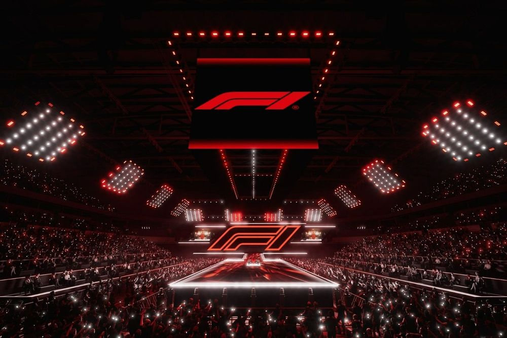

EVENTO 1: Presentación de equipos de la temporada de la F1 
-
En este evento las diez escuderías presentaron conjuntamente sus monoplazas y alineaciones de pilotos para la temporada 2025. Este evento sin precedentes permitió a los aficionados conocer de primera mano las novedades y cambios en cada equipo.
El evento destacó por su impresionante tecnología, combinando un show de luces y grandes pantallas LED para generar en sus asistentes una gran experiencia.

### PROPUESTA PARA EL EVENTO
A pesar de que ya es una gran experiencia, me gustaría agregarle más interactividad a este proyecto añadiendo dos grandes componentes: 

**1. Simulador de salida de una carrera real de F1:**  Puestos con sensores en la arena donde los fans pueden reaccionar al semáforo de salida de una carrera virtual, viendo su tiempo de reacción en comparación con pilotos reales.
También se puede implementar el ranking en vivo en la pantalla LED mostrando quién tuvo el mejor tiempo de reacción y dar premios simbólicos (merchandising oficial de F1) para los asistentes con los mejores resultados.

**2. Pulseras LED** Cada fan recibe una pulsera LED háptica sincronizada con la presentación y el show de luces, tiene vibración con el sonido de los motores cuando los autos aparecen en escena y se podría incorporar cambiar de color según el equipo que está en el escenario.

### INPUTS
- Botones en cada puesto de simulación.
- Semáforo virtual sincronizado con la pantalla LED.
- Sistema de registro de tiempos de reacción de los asistentes.
- Tecnología de sincronización RF o Bluetooth para controlar las pulseras en tiempo real.
- Sensores de sonido y vibración para simular el motor de los monoplazas.
- 
### PROCESAMIENTO
1. El sistema detecta la presión sobre el sensor en el momento en que el semáforo cambia de rojo a verde, se mide el tiempo de reacción de cada participante y se compara con los tiempos promedio de los pilotos de F1, los datos se envían a la pantalla LED principal y al ranking en vivo. Los mejores tiempos quedan registrados y al final se anuncian los ganadores.

2.  La pulsera recibe señales en tiempo real desde el sistema central del evento, vibran cuando se proyectan imágenes del motor encendiéndose, cambia de color según el equipo que está en el escenario y finalmente sincroniza efectos luminosos con la música y el show de luces.

### OUTPUTS
1. El Ranking en vivo proyectado en la pantalla LED, el anuncio de los mejores tiempos con efectos visuales y sonido y finalmente la premiación de los asistentes con el mejor tiempo de reacción con merchandising de F1.

2. Pulseras que iluminan todo el recinto con los colores de cada equipo, las vibraciones que aumentan la inmersión del espectador en el sonido del motor.

### STORYTELLING
Los usuarios ponen a prueba su capacidad para reaccionar en el simulador de salida, solo los más rápidos podrán competir con los tiempos de reacción de los mejores pilotos del mundo. Al mismo tiempo sienten la F1 como nunca antes. Con las pulseras LED hápticas, no solo veran la presentación, sino que la viviran en cada vibración y cada luz.

EVENTO 2: Desfile de Modas
-
### PROPUESTA DEL EVENTO 
Un desfile donde los asistentes diseñan sin saberlo los atuendos que luego verán en pasarela. Cada invitado recibe un iPad al ingresar y tiene unos minutos para dibujar lo que quiera: formas, líneas, garabatos o incluso escribir palabras (No saben cómo se usará su dibujo, solo que será parte del desfile). El giro inesperado es que una IA generativa reorganiza, mezcla y transforma todos los dibujos en prints únicos para los atuendos de los modelos.Cuando empieza el desfile, los asistentes ven con sorpresa cómo sus trazos abstractos se convirtieron en diseños reales en las prendas. Al final del desfile cada invitado puede ir a ver de cerca la pieza que se creó con su dibujo.

### INPUTS
- Cada invitado recibe una tableta al ingresar y tiene 5 minutos para dibujar lo que desee: trazos, palabras, figuras abstractas.
- No se les da información sobre cómo se usará, solo que será parte del desfile.
- Nombre o iniciales del invitado.
- Vestuarios blancos simulando lienzos.
  
### PROCESAMIENTO
Recepción y almacenamiento de los dibujos, se guardan en una base de datos con un identificador único por usuario. La IA mezcla y reorganiza los trazos generando prints únicos para los atuendos y se aplican estilos artísticos o temáticos según la estética del desfile (como el glitch en la exp de Diesel) y finalmente se implementa la impresión digital sobre tela y se vinculan los diseños con los nombres o iniciales de los asistentes y se proyectan en las pantallas a medida que el desfile va ocurriendo. 

### OUTPUTS
Los modelos presentan los outfits con los prints generados por la IA y el usuario se sorprende por ver su nombre en la gran pantalla refiriendose a él como "Co-diseñador" y ver pasar su diseño de hace unos minutos reflejado en una prenda. Al finalizar el desfile, cada asistente puede acercarse a la prenda que contiene su diseño y decidir si comprarla o descargar su diseño y compartirlo en redes sociales. 

### STORYTELLING
Esta propuesta reinventa el concepto de desfile de moda, pasando de un show pasivo a una experiencia interactiva, emocional y colaborativa. Los asistentes se convierten en co-creadores sin saberlo, y el momento de la revelación genera un impacto inolvidable
