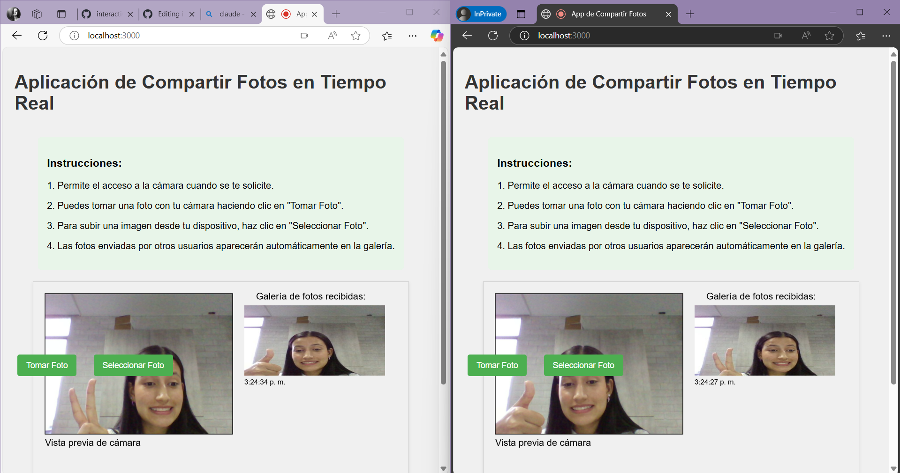

muestra el código de la aplicación: servidor y clientes. Explica claramente:

El sistema se ve la siguiente manera: 

**Cliente 1 en el lado izquierdo y cliente 2 en el lado derecho:**



**Mi código de Sketch.js (Cliente):**

```
let capture;
let socket;
let photoGallery = [];
let captureButton;
let uploadButton;
let fileInput;

function setup() {
  createCanvas(640, 480);
  background(240);
  
  // Inicializar la conexión WebSocket
  socket = new WebSocket(`ws://${window.location.host}`);
  
  socket.onopen = () => {
    console.log('Conectado al servidor WebSocket');
  };
  
  socket.onmessage = (event) => {
    // Recibir imagen de otros usuarios
    let reader = new FileReader();
    reader.onload = function() {
      // Pre-cargar la imagen antes de añadirla a la galería
      loadImage(reader.result, img => {
        let imgObj = {
          img: img,
          timestamp: new Date().toLocaleTimeString()
        };
        photoGallery.push(imgObj);
        // Mantener solo las últimas 10 imágenes
        if (photoGallery.length > 10) {
          photoGallery.shift();
        }
      });
    };
    reader.readAsDataURL(event.data);
  };
  
  socket.onerror = (error) => {
    console.error('Error de WebSocket:', error);
  };
  
  // Inicializar cámara
  capture = createCapture(VIDEO);
  capture.size(320, 240);
  capture.hide();
  
  // Botón para capturar foto
  captureButton = createButton('Tomar Foto');
  captureButton.position(20, 520);
  captureButton.mousePressed(takePhoto);
  
  // Crear input para archivos primero
  fileInput = createFileInput(handleFile);
  fileInput.position(-200, -200); // Posicionarlo fuera de la vista
  
  // Botón para subir foto
  uploadButton = createButton('Seleccionar Foto');
  uploadButton.position(150, 520);
  uploadButton.mousePressed(() => {
    fileInput.elt.click();
  });
}

function draw() {
  background(240);
  
  // Mostrar vista previa de la cámara
  image(capture, 20, 20, 320, 240);
  
  // Dibujar un marco alrededor de la cámara
  noFill();
  stroke(0);
  rect(20, 20, 320, 240);
  
  // Mostrar imágenes recibidas en la galería
  displayGallery();
  
  // Mostrar instrucciones
  fill(0);
  noStroke();
  textSize(16);
  text('Vista previa de cámara', 20, 280);
  text('Galería de fotos recibidas:', 380, 30);
}

function takePhoto() {
  // Capturar imagen de la cámara
  let photo = capture.get();
  
  // Guardar la imagen en un canvas y convertirla a blob
  let canvas = document.createElement('canvas');
  canvas.width = photo.width;
  canvas.height = photo.height;
  
  // Dibujar la imagen en el canvas
  let ctx = canvas.getContext('2d');
  ctx.drawImage(photo.canvas, 0, 0);
  
  canvas.toBlob((blob) => {
    // Enviar la imagen por WebSocket
    if (socket && socket.readyState === WebSocket.OPEN) {
      socket.send(blob);
      console.log('Foto enviada');
    }
  }, 'image/jpeg', 0.85);
}

function handleFile(file) {
  console.log('Archivo seleccionado:', file.name, file.type, file.size);
  
  if (file.type.startsWith('image')) {
    // Procesar solo si es una imagen
    // Usando FileReader para leer el archivo como ArrayBuffer
    let reader = new FileReader();
    reader.onload = function() {
      let blob = new Blob([reader.result], {type: file.type});
      
      // Enviar blob directamente por WebSocket
      if (socket && socket.readyState === WebSocket.OPEN) {
        socket.send(blob);
        console.log('Imagen subida enviada:', file.name);
      }
    };
    reader.readAsArrayBuffer(file.file);
  } else {
    console.log('El archivo seleccionado no es una imagen');
  }
}

function displayGallery() {
  // Mostrar las últimas 3 imágenes recibidas
  let startIdx = Math.max(0, photoGallery.length - 3);
  
  for (let i = startIdx; i < photoGallery.length; i++) {
    let idx = i - startIdx;
    let item = photoGallery[i];
    
    // La imagen ya está cargada, simplemente mostrarla
    image(item.img, 360, 40 + idx * 140, 240, 120);
    
    // Añadir información de tiempo
    fill(0);
    noStroke();
    textSize(12);
    text(item.timestamp, 360, 40 + idx * 140 + 135);
  }
}
```
**Mi código de Server.js (Servidor):**

```
const express = require('express');
const http = require('http');
const WebSocket = require('ws');
const path = require('path');

// Crear servidor Express
const app = express();
const server = http.createServer(app);

// Configurar servidor WebSocket con opciones para manejar imágenes grandes
const wss = new WebSocket.Server({ 
  server,
  maxPayload: 10 * 1024 * 1024 // 10MB máximo tamaño de mensaje
});

// Almacenar conexiones activas
const clients = new Set();

// Manejar conexiones WebSocket
wss.on('connection', (ws) => {
  console.log('Cliente conectado');
  clients.add(ws);

  // Manejar mensajes recibidos
  ws.on('message', (message) => {
    console.log(`Imagen recibida (${message.length} bytes), reenviando a otros clientes`);
    
    // Reenviar el mensaje a todos los clientes excepto al que lo envió
    clients.forEach((client) => {
      if (client !== ws && client.readyState === WebSocket.OPEN) {
        try {
          client.send(message);
        } catch (e) {
          console.error('Error al enviar mensaje:', e);
        }
      }
    });
  });

  // Manejar errores
  ws.on('error', (error) => {
    console.error('Error de WebSocket:', error);
  });

  // Manejar desconexiones
  ws.on('close', () => {
    console.log('Cliente desconectado');
    clients.delete(ws);
  });
});

// Servir archivos estáticos desde la carpeta 'public'
app.use(express.static(path.join(__dirname, 'public')));

// Iniciar servidor
const PORT = process.env.PORT || 3000;
server.listen(PORT, () => {
  console.log(`Servidor ejecutándose en http://localhost:${PORT}`);
});
```

**¿Cómo se comunican los clientes con el servidor?**

La comunicación entre los clientes y el servidor se realiza mediante WebSockets.

El cliente establece una conexión WebSocket con el servidor al cargar la página web (socket = new WebSocket(ws://${window.location.host});)

Una vez establecida la conexión, tanto el cliente como el servidor pueden enviar mensajes en cualquier momento sin necesidad de iniciar nuevas solicitudes HTTP.

**¿Cómo se comunican los clientes entre sí?**

En este caso los clientes no se comunican entre sí, sino que funciona de la siguiente manera: 
1. Un cliente (A) envía una imagen al servidor.
2. El servidor recibe el mensaje y lo reenvía a todos los demás clientes conectados (excepto al cliente A).
3. Los otros clientes reciben el mensaje reenviado por el servidor.

Investigué un poco acerca de esta manera de comunicación y resulta que este modelo se conoce como "broadcasting" centralizado, donde el servidor actúa como intermediario para todos los mensajes.

**¿Qué tipo de mensajes se envían?**

En este caso los mensajes que se envian son solamente imágenes, qué pueden ser tomadas en el momento o seleccionadas desde el dispositivo del usuario.

**¿Qué tipo de datos se envían?**

Para esta pregunta me asesoré de la IA ya que no tenía muy claro en que formato se estaban enviando los datos y esto me explicó: 

Los datos se envían en formato binario de la siguiente manera: 

- Las imágenes se convierten a objetos Blob antes de ser enviadas
- En el caso de fotos de la cámara: se captura la imagen del video, se dibuja en un canvas y se convierte a Blob con compresión JPEG
- Para imágenes subidas: se lee el archivo como ArrayBuffer y se convierte a Blob manteniendo su tipo MIME original
- El servidor recibe estos Blobs y los reenvía tal cual a los demás clientes
- Los clientes receptores utilizan FileReader para convertir los Blobs recibidos a URLs de datos (data URLs)

**¿Qué tipo de eventos se generan?**

En este caso se manejan varios tipos de eventos:

**En el servidor:**

connection: Cuando un nuevo cliente se conecta
message: Cuando se recibe un mensaje (imagen) de un cliente
error: Cuando ocurre un error en la conexión WebSocket
close: Cuando un cliente se desconecta

**En el cliente:**

onopen: Cuando se establece la conexión con el servidor
onmessage: Cuando se recibe un mensaje (imagen) del servidor
onerror: Cuando ocurre un error en la conexión
Eventos UI: clicks en botones para tomar fotos o seleccionar archivos
Eventos de procesamiento de archivos: cuando se carga una imagen seleccionada

**¿Cómo es el flujo de datos entre los clientes y el servidor?**

**Cliente hacia servidor:**

El cliente captura una foto o selecciona una imagen
La imagen se procesa y convierte a Blob
El Blob se envía al servidor a través de la conexión WebSocket (socket.send(blob))
El servidor recibe el mensaje binario (Blob)

**Servidor hacia clientes:**

El servidor identifica al remitente del mensaje
El servidor reenvía el mensaje (Blob) a todos los demás clientes conectados
Cada cliente recibe el mensaje a través del evento onmessage

**¿Cómo es el flujo de datos entre los clientes?**

Como mencioné anteriormente, no hay comunicación directa entre clientes. El flujo completo entre dos clientes sería:

1. Cliente A toma o selecciona una imagen.
2. Cliente A procesa la imagen y la convierte a Blob.
3. Cliente A envía el Blob al servidor.
4. El servidor recibe el Blob de Cliente A.
5. El servidor reenvía el Blob a todos los demás clientes (incluido Cliente B).
6. Cliente B recibe el Blob.
7. Cliente B procesa el Blob: lo lee con FileReader, lo convierte a data URL.
8. Cliente B carga la imagen con p5.js y la muestra en su galería.
