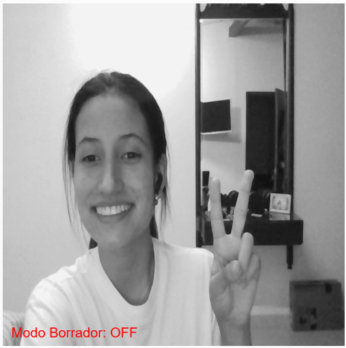

TUTORIAL COOL APLICANDO p5LiveMedia 
-
La aplicación que propongo es una que permita la transmisión de video con un filtro en blanco y negro, además permite el dibujo de bolitas con el mouse y que cada trazo tiene un color aleatorio. Por último permite el modo de borrar las bolitas que quieras pulsando la letra E. 
Vamos a dividir la creación de este producto en varias fases: 
### FASE 1: Configuración inicial (  setUp() )
El objetivo de este primer paso es inicializar el lienzo, la cámara y la conexión con p5LiveMedia. Además declaramemos las variables principales.

- Lo primero que haremos es crear el lienzo (createCanvas(400, 400)).
- Luego activaremos la cámara con el comando de p5 (createCapture(VIDEO)).
- Iniciaremos la conexión con p5LiveMedia para compartir el video y el lienzo en vivo.
- Finalmente se define la aleatoriedad del color de cada trazo.
  
El código se ve de la siguiente manera: 
```
let myVideo;
let otherVideo;
let myCanvas;

let drawing = [];
let currentColor;
let eraseMode = false; // Modo borrador (inicialmente apagado)

function setup() {
  myCanvas = createCanvas(400, 400);
  myVideo = createCapture(VIDEO);
  myVideo.muted = true;
  myVideo.hide();

  let p5l = new p5LiveMedia(this, "CANVAS", myCanvas, "party");
  p5l.on('stream', gotStream);

  currentColor = getRandomColor();
}
```

### FASE 2: Dibujo del lienzo y aplicación del filtro al video ( draw() )
El objetivo de esta segunda fase es mostrar el video en blanco y negro, dibujar los trazos de colores y mostrar el estado del modo borrador.

- Limpiamos el lienzo con (background(220)).
- Luego hacemos un paso importante para poder aplicar el filtro  blanco y negro: capturamos una imagen del video (get()).
  Para este paso vamos a explicar la importancia de hacerlo así:
  
  - con ayuda del myVideo.get() tomamos una captura instantánea del video que se está reproduciendo en myVideo y la almacena en la variable videoImage.
  - videoImage es ahora un objeto de tipo p5.Image, que es básicamente una imagen estática en memoria.

    **¿Por qué se necesitamos esto?**
    Porque filter(GRAY) (en la siguiente línea) solo funciona sobre objetos de tipo p5.Image, no sobre video directamente y myVideo.get() convierte el video en tiempo real en una imagen estática sobre la que se pueden aplicar filtros.
- Después de aplicar el filtro de blanco y negro, dibujamos la imagen filtrada (image(videoImage, 0, 0, width, height)).
- También dibujamos las bolitas del trazo (ellipse(x, y, 10, 10)).
- Finalmente mostramos en pantalla si el modo borrador está activado o desactivado.

El código de esta fase se ve de la siguiente manera: 
```
function draw() {
  background(220);

  // Crear una imagen del video y aplicar filtro blanco y negro
  let videoImage = myVideo.get();
  videoImage.filter(GRAY);
  image(videoImage, 0, 0, width, height);

  // Dibujar las bolitas de colores
  for (let i = 0; i < drawing.length; i++) {
    fill(drawing[i].color);
    noStroke();
    ellipse(drawing[i].x, drawing[i].y, 10, 10);
  }

  // Mostrar modo actual en pantalla
  fill(255, 0, 0);
  textSize(16);
  text(eraseMode ? "Modo Borrador: ON" : "Modo Borrador: OFF", 10, height - 10);
}
```

con este código haremos que se vea de esta manera: 



### FASE 3: Establezcamos la interacción con el usuario

El objetivo de esta fase es que podamos cambiar el color del trazo cada vez que el usuario hace clic, dibujar o borrar dependiendo del modo seleccionado y alternar el modo borrador con la tecla "E".
Para hacer esto posible debemos usar tres eventos que se encargaran de las funcionalidades más importantes: 

**1. mousePressed() : Elegir un nuevo color**

  Aquí declaramos que si el modo borrador está desactivado (eraseMode === false), cambia el color del trazo y si el borrador está activado, no hace nada.
  ```
  function mousePressed() {
  if (!eraseMode) {
    currentColor = getRandomColor();
  }
}
  ```
**2. mouseDragged(): Dibujar o borrar**

  Este evento permite dibujar o borrar según el estado del evento anterior, si **eraseMode está activado** (true):Filtra el array drawing[] eliminando los puntos cercanos al cursor (dist(point.x, point.y, mouseX, mouseY) > 10 : Solo conserva los puntos que están más lejos de 10px del cursor).
  Y si **eraseMode está desactivado** (false):Agrega un nuevo punto con el color actual.

  ```
  function mouseDragged() {
  if (eraseMode) {
    // Borrar puntos cercanos al cursor
    drawing = drawing.filter(point => dist(point.x, point.y, mouseX, mouseY) > 10);
  } else {
    // Agregar un nuevo punto
    drawing.push({ x: mouseX, y: mouseY, color: currentColor });
  }
}
  ```
**3. keyPressed(): Alternar el modo borrador**

El objetivo de este evento es controlar que si el usuario presiona "E" o "e", cambia eraseMode y esto activa o desactiva el modo borrador.

```
function keyPressed() {
  if (key === "E" || key === "e") {
    eraseMode = !eraseMode;
  }
}
```

### FASE 4: Funciones complementarias que necesitamos
En este pedazo del código buscamos generar los colores aleatorios y manejar las conexiones de p5LiveMedia.

- Lo que hacemos es que el getRandomColor()  Genera un color aleatorio con random(255) y el gotStream(stream) se ejecuta cuando llega un nuevo stream de video.

   ```
  function getRandomColor() {
  return color(random(255), random(255), random(255));}

  function gotStream(stream) {
    otherVideo = stream; }
  ```
