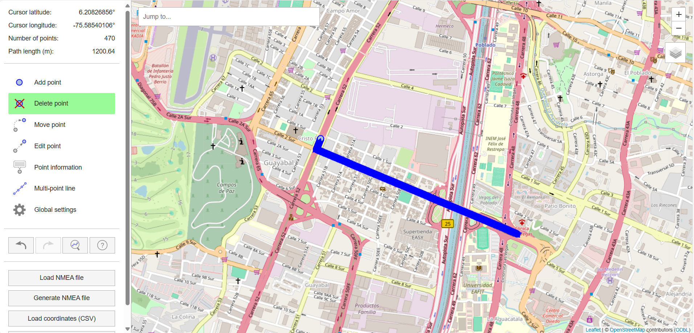
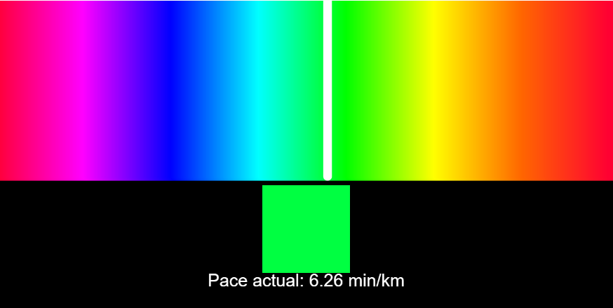

INPUTS DETALLADOS
-

**1. Simulación del recorrido  del corredor (GPS Simulator)**

Para simular la ruta de un corredor en tiempo real, utilizamos un simulador de GPS que genera un archivo con coordenadas geográficas en formato NMEA. Este formato lo usaremos en un código en p5.js que sacará  las velocidades en determinado tramo **(para mi demo decidí que será de 1km)** de un corredor con ritmo promedio de 6:30 min/km que recorre 2.5 m/s (estas son las especificaciones con las que configuré el GPS simulator para verificar que si funcionara y efectivamente si sirvió. La ruta es generada artificialmente usando una herramienta de simulación GPS. Esta herramienta permite trazar un trayecto (por ejemplo, 1 metro de distancia) y descargar un archivo de datos simulados que emulan el movimiento de un corredor. 

El tipo de dato que se recibirá en el primer código serán coordenadas geográficas (latitud, longitud) y el formato esperado luego de que el código nos saque la velocidad será decimal. Finalmente las velocidades obtenidas serán enviadas al código de p5.js encargado de hacer las visualizaciones (que estará parametrizado el color del fondo para que se modifique con estos datos de velocidad) 

Para ver más o menos cómo hacerlo, tracé una ruta de 1km más o menos y configuré el programa como si fuera un corredor que hace 2,5 m/s: 

**Ruta: Desde el puente de la 4 sur hasta el parque de cristo rey**

 

Luego saqué el archivo con las coordenadas y otras informaciones y con ayuda del código de p5.js saqué las velocidades:

[CLIC AQUÍ PARA VER CÓMO OBTENDRIAMOS LAS VELOCIDADES CON EL CÓDIGO DE p5.js](https://editor.p5js.org/manuuuu15281/sketches/OfDxS9mYy)

Pdt: Es importante aclarar que aún no se si me sirva de la manera en que lo tengo en este código (ojalá que si). Aún debo probarlo y verificar si es posible hacer el envio de las velocidades en un array.

Por último, quise experimentar en cómo hacer los visuales con p5.js y funcionó pero en esta  parte simulé dentro del mismo código las velocidades (solo para ver como se movía el fondo y si era fluido, era más para ver la parte del diseño), logré que se viera fluido y dentro de los rangos de colores que establecí desde la unidad pasada para las distintas velocidades. 

[CLIC AQUÍ PARA VER CÓMO SE VERÁN EL FONDO DE LOS VISUALES CON EL CÓDIGO DE p5.js](https://editor.p5js.org/manuuuu15281/sketches/7yMoI1-Tl)

Un tercer input proviene de un dispositivo móvil, que cumple la función de panel de control remoto para el administrador de la carrera. Desde allí, se puede seleccionar el modo de ambientación visual según la ciudad donde se realice la carrera. El tipo de dato será texto (etiqueta de ciudad) y su el formato será un String. Ejemplos: "cartagena", "bogota", "medellin", "pasto", "quindio".

Esto lo voy a simular a través de una interfaz con botones (radio buttons o menú desplegable) desde una aplicación en p5.js. Su importancia dentro de la experiencia es que define el estilo visual y decorativo de los elementos culturales. Por ejemplo, si se elige “Cartagena”, los animales que aparecen en pantalla pueden estar adornados con accesorios playeros, mientras que en “Bogotá” tendrían indumentaria andina o urbana. Este parámetro también actúa como un filtro que modifica el carácter de la visualización general.

